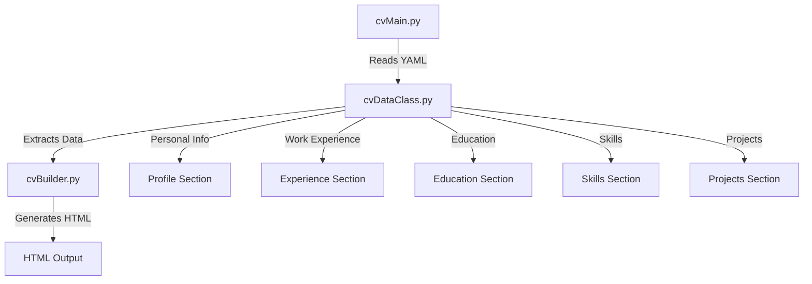

# SmartCVBuilder

SmartCVBuilder is an open-source Python project designed to generate professional CVs in HTML and PDF format from YAML data files. The project leverages modular code to handle CV data and convert it into a structured HTML document, styled using CSS.

## Table of Contents

- [Installation](#installation)
- [Usage](#usage)
- [Project Structure](#project-structure)
- [Configuration](#configuration)
- [Mermaid Diagram](#mermaid-diagram)
- [License](#license)


## Installation

To install the required dependencies for SmartCVBuilder, use the following commands:

1. **Install `wkhtmltopdf`**:
   - **Ubuntu/Debian**: `sudo apt-get install wkhtmltopdf`
   - **macOS**: `brew install Caskroom/cask/wkhtmltopdf`
   - **Windows**: Download and run the installer from [wkhtmltopdf downloads page](https://wkhtmltopdf.org/downloads.html)

2. **Install Python packages**:

```bash
pip install -r requirements.txt
```

Ensure you have the necessary YAML and HTML/CSS files prepared for generating the CV.

## Usage

You can run the script from the command line by specifying the YAML and CSS files:

```bash
python cvMain.py my_cv.yml my_style.css
```

If no arguments are provided, the script defaults to `template.yml` and `template.css`.

## Project Structure

The project is organized as follows:

```plaintext
SmartCVBuilder/
├── cvBuilder.py
├── cvDataClass.py
├── cvMain.py
├── README.md
└── styles/
    ├── style01.css
    ├── etc
└── templates/
    ├── template.yml
    └── template.jpg
```

- **cvBuilder.py**: Contains functions to generate the HTML content of the CV.
- **cvDataClass.py**: Defines the `CVData` class to handle operations related to CV data stored in a YAML file.
- **cvMain.py**: The main entry point for the script, orchestrating the generation process.
- **requirements.txt**: Lists the dependencies required for the project.
- **templates/**: Contains example YAML and CSS templates.

## Configuration

### HTML Configuration

The HTML generation settings are configured within `cvBuilder.py`:

```python
G_CONFIG_HTML = {
    'page_size': 'A4',
    'margin': '0mm',
    'encoding': 'UTF-8',
    'enable_local_file_access': True,
}
```

### PDF Configuration

Though not currently implemented, the PDF configuration is outlined in `cvMain.py`:

```python
G_CONFIG_PDF = {
    'page_size': 'A4',
    'margin': '0mm',
    'encoding': 'UTF-8',
    'enable_local_file_access': True,
    'pdf_options': {
        'page-size': 'A4',
        'margin-top': '0mm',
        'margin-right': '0mm',
        'margin-bottom': '0mm',
        'margin-left': '0mm',
        'encoding': 'UTF-8',
        'enable-local-file-access': ""
    }
}
```

## Mermaid Diagram

Here is a Mermaid diagram to visualize the process flow of SmartCVBuilder:



## License

This project is licensed under the GNU GENERAL PUBLIC License. See the [LICENSE](LICENSE) file for details.